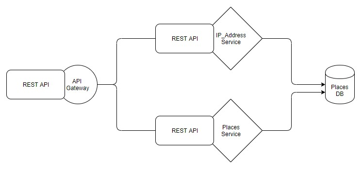
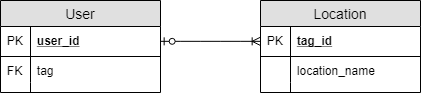

# Nearby-Service :round_pushpin:
Project นี้เป็นส่วนหนึ่งของรายวิชา Service-Oriented Programming 
Faculty of Information Technology, KMITL

## About Service :page_facing_up:
    จะเป็น service ที่เก็บข้อมูลของผู้ใช้ ว่ามีพฤติกรรมชอบไปในสถานที่ใด
    แล้วจะแนะนำสถานที่ที่ผู้ใช้อาจจะสนใจเดินทางไป
  
## Service Architecture :hammer:
   
   
## API :pencil:
    {
    "ip_address" : "String",
    "might_go_places" : [
            {
            "place1" : {
                "place_name" : "String",
                "visit_count" : "int",
                "place_tag" : [],
                "avg_spending_time" : "Double",
                "Routes" : []
            },
            "place2" : {
                "place_name" : "String",
                "visit_count" : "int",
                "place_tag" : [],
                "avg_spending_time" : "Double"
                }
            }
        ]
    }
## Database in Service :file_folder:
   
### Schema
    User(user_id, tag)
    Location(tag_id, location_name)
## Team Members :busts_in_silhouette:

Name | StudentID | Github Username
------------ | ------------- | -------------
นายตฤณภัทร ปลั่งศรี | 60070028 | @Tintinap
นายนนท์ นิลขำ | 60070036 | @naive555
นางสาวพัณณิตา เหมโก | 60070061 | @Pannita2212
นายภูมิ เนตราคม | 60070074 | @xzsawq47
นางสาวสุธาทิพย์ ศรีโกษะบาล | 60070104 | @yves99
