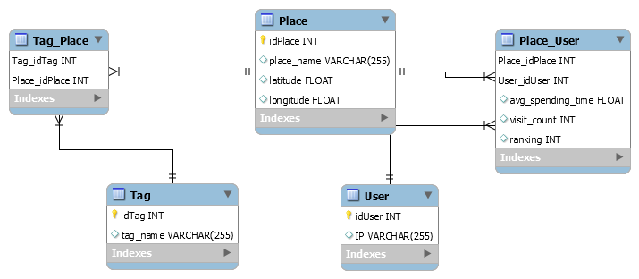

# Nearby-Service :round_pushpin:
Project นี้เป็นส่วนหนึ่งของรายวิชา Service-Oriented Programming 
Faculty of Information Technology, KMITL

## About Service :page_facing_up:
    เป็น service ที่เก็บข้อมูลของผู้ใช้ ว่ามีพฤติกรรมชอบเดินทางไปในสถานที่ใด
    จากนั้นจะแนะนำสถานที่ที่ผู้ใช้อาจจะสนใจเดินทางไปยังสถานที่นั้น
  
## Service Architecture :hammer:
   
   
   
## API :pencil:
    TBC........    {
    "ip_address" : "String",
    "might_go_places" : [
        {
            "place" : {
                "place_name" : "String",
                "location" : {
                    "lat":"Double",
                    "long":"Double",
                 },
                "visit_count" : "int",
                "place_tag" : [],
                "avg_spending_time" : "Double",
            }
        },
        {
            "place" : {
                "place_name" : "String",
                "location" : {
                    "lat":"Double",
                    "long":"Double",
              
              },
                "visit_count" : "int",
                "place_tag" : [],
                "avg_spending_time" : "Double",
            }
        },
        .
        .
        .
    ],
    "status" : "String"
    }
## Database in Service :file_folder:
   
### Schema
   User(**user_id**, ip)
   Place(**idPlace**, place_name, latitude, longitude)
   Tag(**idTag**, tag_name)
   Place_User(**Place_idPlace**, **User_idUser**, avg_spending_time, visit_count, ranking)
   Tag_Place(**Place_idPlace**, **Tag_idTag**)
    
## Team Members :busts_in_silhouette:

Name | StudentID | Github Username | Position
------------ | ------------- | ------------- | -------------
นายตฤณภัทร ปลั่งศรี | 60070028 | @Tintinap | Developer
นายนนท์ นิลขำ | 60070036 | @naive555 | Developer
นางสาวพัณณิตา เหมโก | 60070061 | @Pannita2212 | Business
นายภูมิ เนตราคม | 60070074 | @xzsawq47 | Developer
นางสาวสุธาทิพย์ ศรีโกศะบาล | 60070104 | @yves99 | Business
